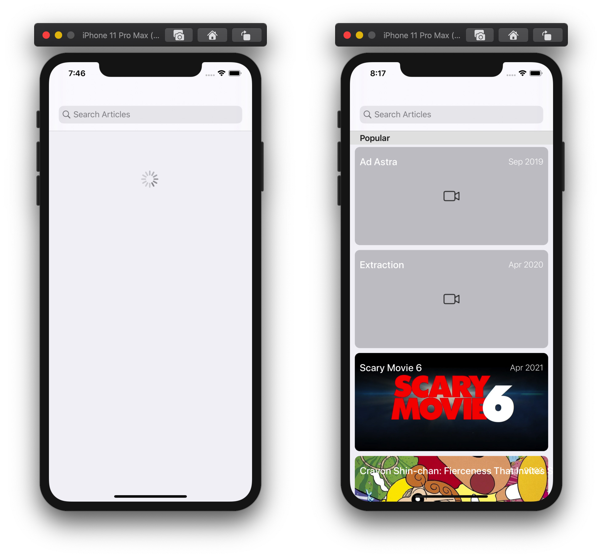
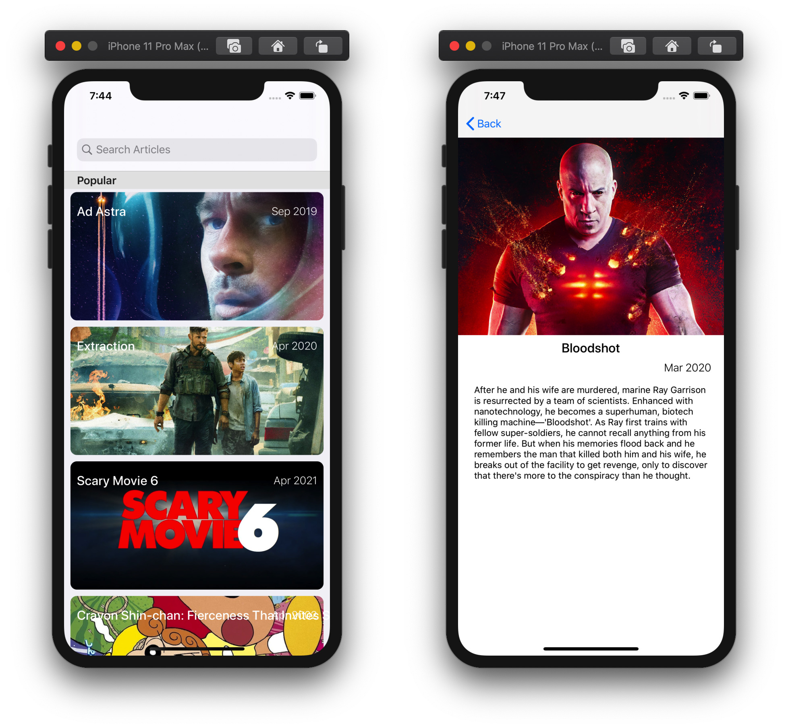

# Movies
An iOS app that fetches movies from themoviedb.org for three different categories and shows them in table view. User can tap on a movie and detail about that movie is shown using an animation.

Below are few screen shots of working of app


Left image shows the initial loading state when app is first launched. Right image shows list of movies. Please note that few images are loaded and few images are waiting for their data to be received from network.


Left image shows the state when all the images of currently visible movies are loaded successfully. Right image shows the movie detail screen.

A video showing the app working can be found [here](https://drive.google.com/open?id=1G8JIWnlpyWZ43km-QBz2Y1ui4QbtsavN)

## How To Run
- Clone the code repository using below command

```git clone https://github.com/khurram18/Movies```
- Navigate to the code directory and open `Movies.xcodeproj` by double clicking on it and opening it in Xcode.
- Press `Command + R` to run the app in iOS Simulator.
